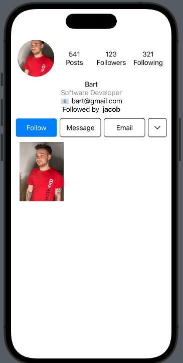

# InstagramUI
The InstagamUI it's a simple project to create views which are imitating original app. Functionalities of the original app are not provided.
Images and text are plain data.
 
 
 

### Used Technologies:
1. SwiftUI
2. SFSymbols

### Images
1. Woman photo by Tim Douglas from Pexels - [a link](https://www.pexels.com/pl-pl/zdjecie/restauracja-kobieta-kelner-kawiarnia-6205635/)

### Screenshots
Home screen:

Profile screen:

